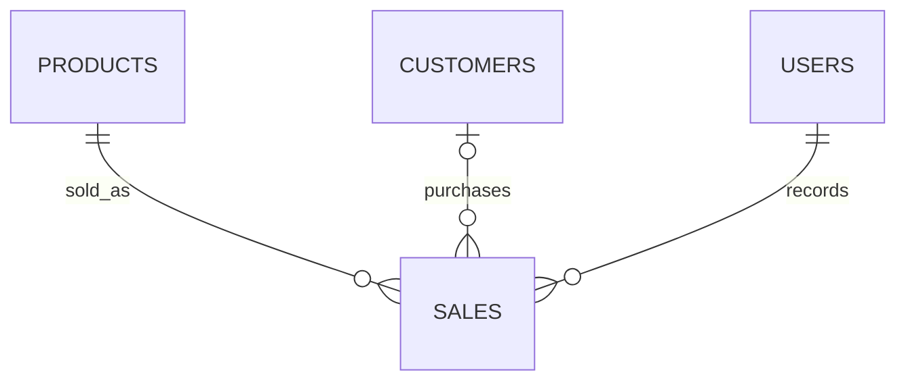
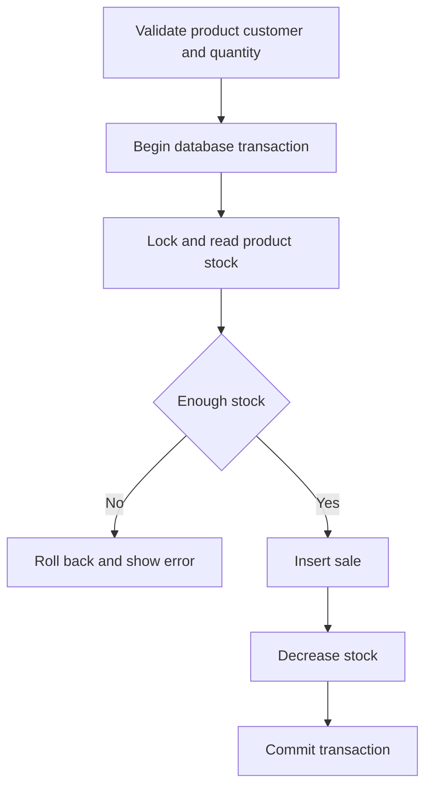

# Application Architecture

## MVC responsibilities

- Controllers validate requests and coordinate each workflow.
- Models read and write one database table each.
- Views display forms, lists, messages, and joined sales data.
- `AuthFilter` blocks every management route unless a staff session exists.

## Relational design

Each sale requires one product and one logged-in staff user. A customer is optional for walk-in sales.

## Sale workflow

The row lock and transaction prevent the sale record and stock quantity from becoming inconsistent.
